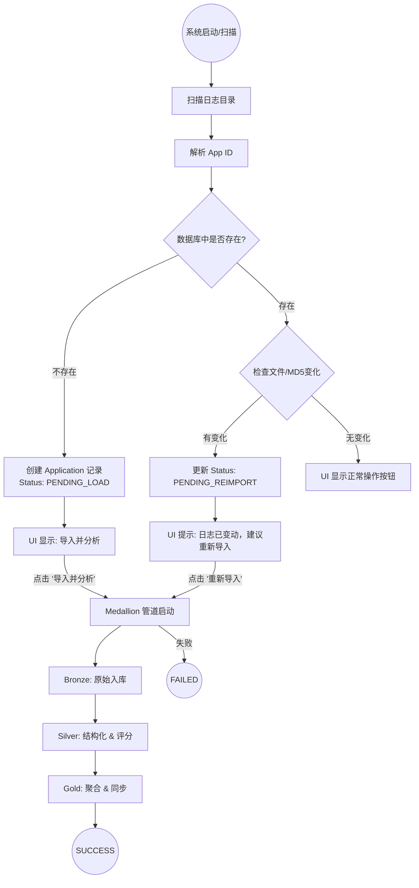

# Spark Performance Insight - Medallion 状态机重构计划 (v2)

## 1. 核心目标
将应用导入流程标准化为数仓 Medallion 架构，并引入“发现-待处理”机制。对于已有应用检测到文件变化时，明确提示用户“建议删除并重新导入”。

## 2. 状态机流程图 (Mermaid)

## 3. 具体执行步骤

### 第一步：数据库 Schema 升级
在 `applications` 表中新增列：
*   `source_file_metadata`: `JSON` 类型。存储文件列表及其 MD5 指纹。
*   `parsing_status` 状态值：
    *   `PENDING_LOAD`: 初始扫描到的新应用。
    *   `PENDING_REIMPORT`: 已解析应用但检测到原始日志文件变动。

### 第二步：后端逻辑重构 (`EventLogWatcherService`)
1.  **指纹比对**：为每个文件计算 MD5。
2.  **状态决策**：
    *   若 AppID 没见过 -> `INSERT applications` (Status: `PENDING_LOAD`)。
    *   若已存在 -> 将当前扫描的 `(filename, md5)` 列表与 `source_file_metadata` 进行深度对比。
    *   若对比不一致 -> `UPDATE applications` (Status: `PENDING_REIMPORT`)。

### 第三步：前端逻辑重构 (`AppList.vue`)
1.  **动态视图**：
    *   `PENDING_LOAD`：Action 列仅显示紫色 **“导入并分析”**。
    *   `PENDING_REIMPORT`：显示警告图标及 **“重新导入”** 按钮。
2.  **管道触发**：点击后调用 Medallion 接口，后端在成功后自动更新 `source_file_metadata`。

---
**请审阅。如认可此“建议重新导入”的交互方案，我将开始执行。**
