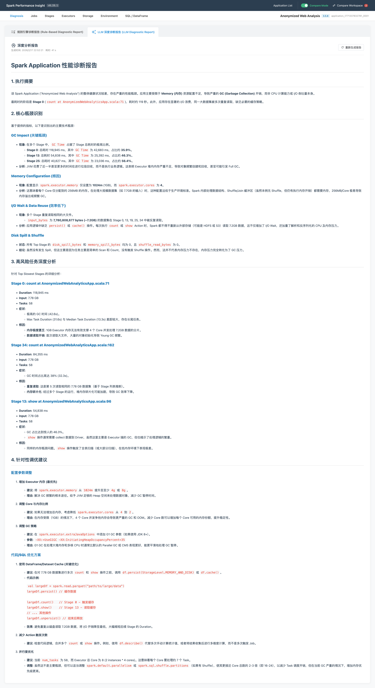
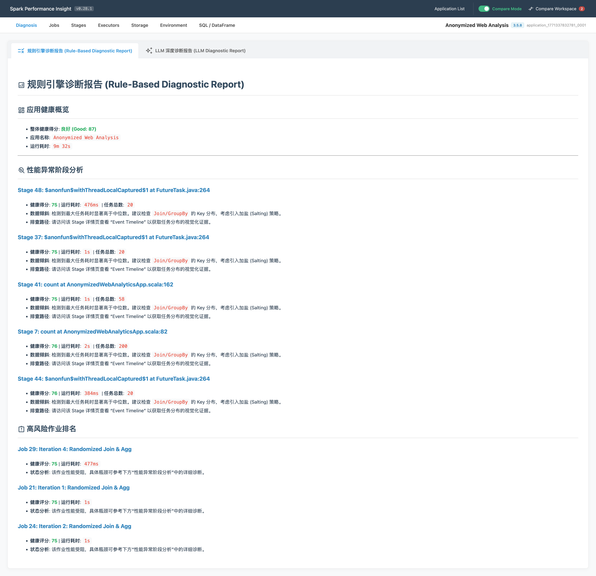
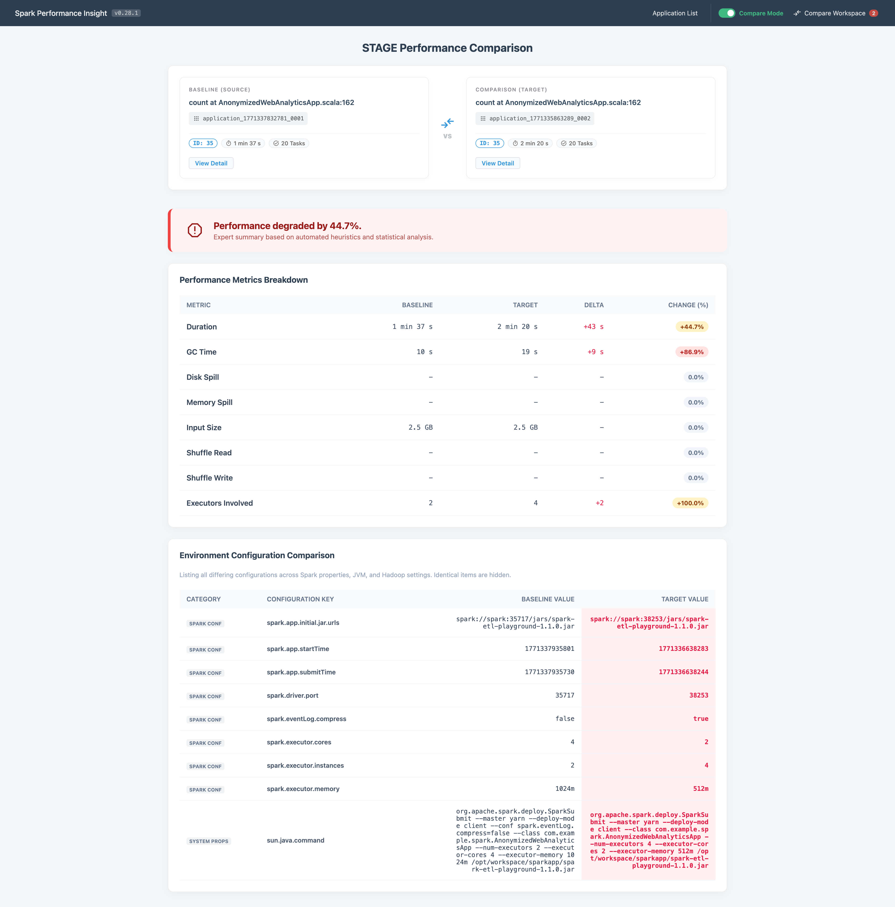
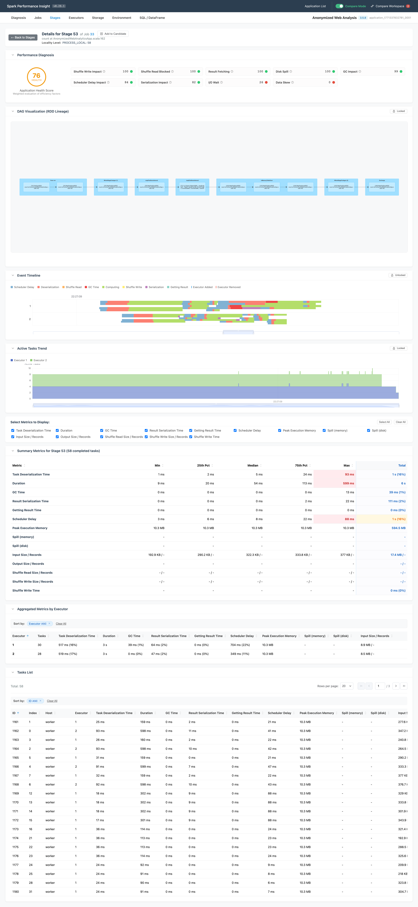
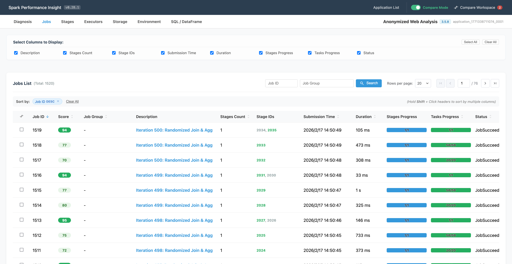
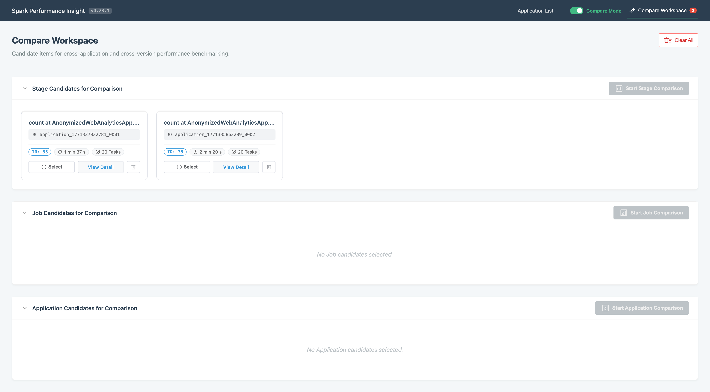
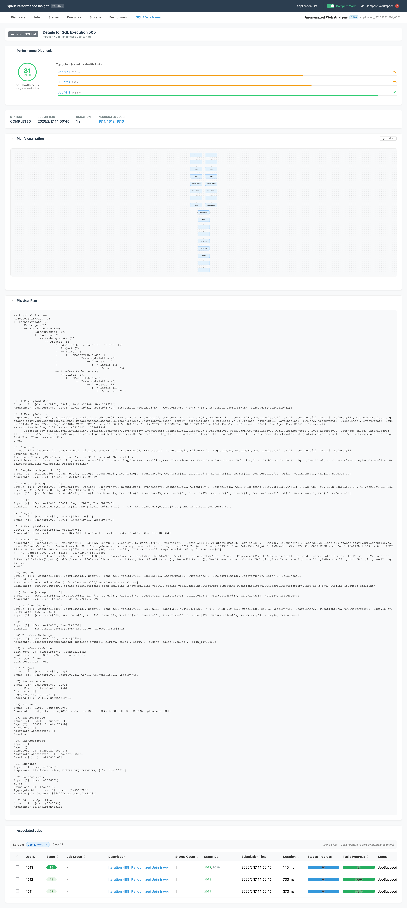
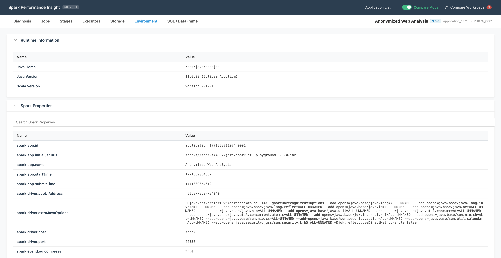

# Spark Performance Insight

English | [中文](./README.zh.md)

[](./CHANGELOG.md)
[](https://github.com/petrel2015/Spark-Performance-Insight/stargazers)
[](https://deepmind.google/technologies/gemini/)
[](https://www.oracle.com/java/technologies/javase/jdk21-archive-downloads.html)
[](https://spring.io/projects/spring-boot)
[](https://vuejs.org/)
[](https://duckdb.org/)
[](https://github.com/petrel2015/Spark-Performance-Insight/actions/workflows/ci.yml)
[](#testing)

---

In the AI era, **this project** aims to revolutionize Spark performance analysis. Centered around Spark, it leverages LLM to provide deep data insights and uses the **Model Context Protocol (MCP)** to expose these capabilities, enabling autonomous and natural language-driven tuning. It effectively addresses the core pain points of the native Spark Web UI/History Server by eliminating "slow replay", "information overload", and "lack of comparison" issues through **Medallion Architecture**, **Smart Diagnosis**, and **Multi-dimensional Benchmarking**.

> **💡 Core Goal: Transform EventLog into actionable intelligence, providing instant answers instead of raw data.**

---

## 🚀 Live Demo

- **Spark Performance Insight:** [http://demo.fluffyeti.com:18081/](http://demo.fluffyeti.com:18081/)
- **Spark History Server (Native - For Comparison):** [http://demo.fluffyeti.com:18080/](http://demo.fluffyeti.com:18080/)

---

## Why Spark Performance Insight?

While the native Spark Web UI provides basic monitoring, users often face significant hurdles during deep performance analysis:

### 1. Information Overload & Obscurity
- **Metric Labyrinth:** Spark UI presents a massive volume of raw metrics and obscure charts. Beginners struggle to find what matters, and experts spend excessive time digging through pages to correlate metrics.
- **Hidden Insights:** Critical bottlenecks like GC pressure or data skew are often buried under layers of sub-menus, making it hard to get a quick "health check" of an application.

### 2. Lack of Meaningful Comparison
- **Unquantifiable Deviations:** When a job slows down compared to yesterday, there is no built-in way to compare the two runs side-by-side to see exactly which stage or task changed.
- **Blind Troubleshooting:** Hard to identify if performance shifts are due to config changes, resource fluctuations, or hardware issues without manual, error-prone data collection.

### 3. History Server Performance Bottlenecks
- **Event Replay Overhead:** Replaying raw JSON EventLogs for massive jobs results in extreme CPU/Memory overhead and minute-long wait times.
- **Scalability Limits:** Without structured storage, the SHS often crashes (OOM) when handling jobs with millions of tasks.

---

## Core Features

### 1. AI-Powered Smart Diagnosis
- **Deep Bottleneck Analysis:** Integrates **Zhipu AI (GLM-4.7)** and **OpenAI** to analyze complex performance issues (e.g., Shuffle IO, GC pressure).
- **Optimization Advice:** Generates expert-level Markdown reports with actionable tuning suggestions tailored to your specific application.



### 2. Model Context Protocol (MCP) Integration 🚀
- **Autonomous Log Analysis:** Exposes Spark Performance Insight as an **MCP server**. AI Agents (Claude, Gemini) can directly "read" and analyze your local Spark logs.
- **Natural Language Tuning:** "Analyze the log at `/tmp/spark-logs/app-1`" — the AI will automatically trigger the parsing pipeline, wait for completion, and provide tuning advice without you leaving the chat.
- **Universal Connectivity:** Supports **Gemini CLI** and **Claude Code** via high-performance HTTP/SSE transport.

> **[Learn more: MCP User Guide](./docs/en/MCP_User_Guide.md)**

### 3. Rule-Based Expert System
- **Statistical Precision:** Unlike the probabilistic nature of LLMs, the rule engine provides deterministic, stable, and highly accurate analysis based on rigorous statistical thresholds.
- **Expert Heuristics:** Codifies years of Spark performance tuning expertise into automated rules for detecting Data Skew, Executor GC pressure, Disk Spilling, and Locality issues.
- **Instant Root Cause:** Provides immediate, quantifiable evidence for performance regressions, serving as the "Gold Standard" for production troubleshooting.



### 3. Multi-dimensional Benchmarking
- **Cross-App Comparison:** Side-by-side comparison of different application instances to identify configuration or resource-induced regressions.
- **Stage Benchmarking:** Deep dive into two stages to compare statistical distributions (P95, Median) and task execution traces.



### 3. Classic UI Parity & Beyond
- **Familiar Interface:** Deeply replicates native Spark UI lists (Jobs, Stages, Tasks) and descriptions to ensure a zero-learning-curve transition for developers.
- **Enhanced Summary:** Provides statistical distributions for all core metrics and high-performance server-side pagination for millions of tasks.



## 🖥 User Interface Gallery

| [Application List (Home)](./docs/en/ui/Application_List.md) | [Job List Overview](./docs/en/ui/Job_List.md) |
|:---:|:---:|
|  |  |
| **[Compare Workspace](./docs/en/ui/Compare_Workspace.md)** | **[SQL / DataFrame Detail](./docs/en/ui/SQL_Detail.md)** |
|  |  |
| **[Environment Config](./docs/en/ui/Environment.md)** | |
|  | |

### 4. Medallion Data Pipeline
- **Bronze (Raw Ingestion):** High-speed streaming ingestion using Jackson, handling TB-sized logs effortlessly.
- **Silver (Transformation):** Structured parsing that recovers logical relationships and identifies long-tail tasks.
- **Gold (Aggregation):** Pre-calculated analytical tables stored in **DuckDB** for instant UI response times.

### 5. Robustness & Compatibility
- **OOM Recovery:** Automatic DuckDB memory management with `CHECKPOINT` and retry logic.
- **Timing Accuracy:** Synchronized epoch milliseconds and monotonic progress tracking for reliable estimates.
- **Broad Log Support:** Native support for **ZSTD** compression and Spark **V2 log directories**.

## Testing

### Backend Testing
Run backend unit tests and generate JaCoCo coverage report:
```bash
mvn clean test
# Coverage Report: target/site/jacoco/index.html
```

### Frontend Testing
Run frontend unit tests and generate Vitest coverage report:
```bash
cd frontend && npm run test:coverage
# Coverage Report: frontend/coverage/index.html
```

## 🛡️ Quality Engineering

This project follows a strict **Quality First** approach, implementing a four-layer guardian system to ensure stability and performance:

1.  **Meaningful Coverage**: We target **70% Line** and **80% Branch** coverage on core logic (Services/Utils), intentionally excluding boilerplate code to ensure our CI acts as a true logic sentinel.
2.  **SQL-Schema Guard**: Integration tests run against a real **DuckDB** instance to ensure MyBatis XML SQLs are always perfectly synchronized with the database schema.
3.  **E2E Parsing Pipeline**: Validates the full Medallion pipeline using real-world Spark EventLogs (ZSTD, V2 formats) to prevent parsing regressions.
4.  **Performance Watchdog (JMH)**: Precise micro-benchmarking using **JMH** to monitor processing latency across Medallion layers, ensuring no heavy performance degradation during feature updates.
5.  **UI Regression Guard**: Structure-based component tests that protect critical UI features (e.g., search, filtering, charts) from accidental breakage.

> **Detailed Strategy**: For a deep dive into our testing philosophy and "Meaningful Coverage" implementation, please refer to the **[Testing Strategy Guide](./docs/en/Testing_Strategy.md)**.

## 🧪 Manual Connectivity Checks

New users can verify their LLM API keys and network connectivity without running the full application by using the manual test tool:
`src/test/java/com/fluffyeti/spark/performance/insight/llm/LLMManualConnectionTest.java`

## 📖 Documentation & Architecture

For deep dives into the system design and technical specifications, please refer to our structured documentation:

*   **[Documentation Index](./docs/en/index.md)**
    *   [System Architecture](./docs/en/Architecture.md)
    *   [Database Schema](./docs/en/Database_Design.md)
    *   [Import State Machine](./docs/en/Application_Import_State_Machine.md)
    *   [EventLog Reference](./docs/en/EventLog_Reference.md)

## Technical Stack

- **Frontend:** Vue 3 + Vite + ECharts + Material Design.
- **Backend:** Java 21 (Virtual Threads) + Spring Boot 3.x.
- **OLAP Engine:** [DuckDB](https://duckdb.org/) (Embedded analytical database).
- **ORM:** MyBatis Plus (XML-based for optimized SQL).

## Quick Start

### Development Mode (Maven Local)

1.  **Build and Start:**
    ```bash
    mvn clean install -Pbuild-frontend
    mvn spring-boot:run
    ```

2.  **Access the UI:**
    Visit `http://localhost:18081` in your browser.

### Auto Build and Run (Docker Managed)

```bash
mvn clean install -Pbuild-frontend -Prun
```

### Production & Comparison Mode (Docker Compose)

Starts both **Spark Performance Insight UI** and **Spark History Server** sharing the same log directory.

1.  **Start Services:**
    ```bash
    docker compose up -d
    ```

2.  **Access Points:**
    -   **Spark Performance Insight UI:** `http://localhost:18081`
    -   **Spark History Server (Native - For Comparison):** `http://localhost:18080`

## 🗺️ Roadmap

- [ ] **Executor Performance Diagnosis**: Implementing deep analysis of executor throughput vs latency to identify resource utilization bottlenecks. See **[Design Doc](./docs/zh/Executor_Performance_Diagnosis_Design.md)**.
- [ ] **DAG Visualization**: Adding X6 or similar for Job/Stage relationship graphs.
- [ ] **Advanced Benchmarking**: Cross-cluster performance comparison logic.

## Acknowledgments

- Special thanks to [JimLiu/baoyu-skills](https://github.com/JimLiu/baoyu-skills.git) for the **release-skills** that streamlines our release workflow.
