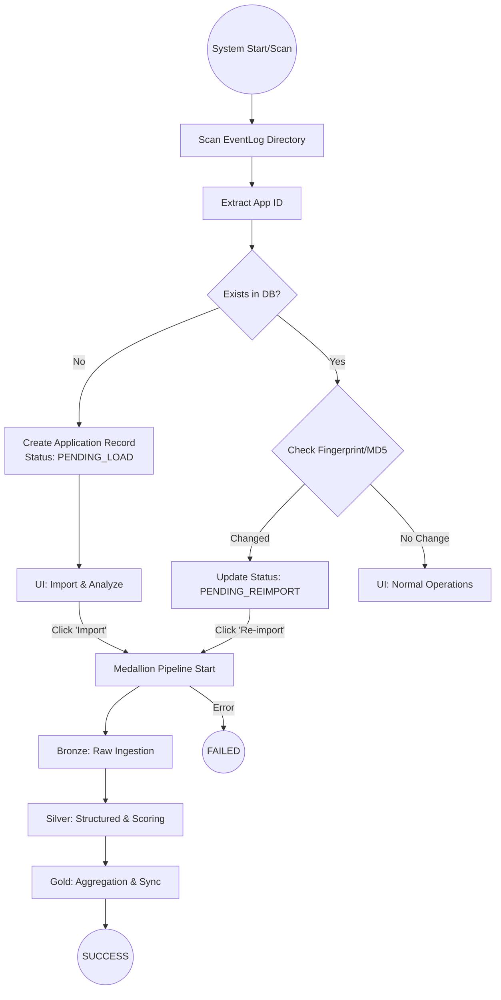

# Application Import State Machine

[English](./Application_Import_State_Machine.md) | [中文](../zh/Application_Import_State_Machine.md)

This document describes the state machine and lifecycle of a Spark EventLog as it moves through the Medallion architecture (Bronze -> Silver -> Gold).

## 1. State Machine Flow

## 2. Status Definitions & Lifecycle

The `applications` table tracks the progress through the following `parsing_status` values:

| Status Code | UI Display | Pipeline Event | Available Actions |
| :--- | :--- | :--- | :--- |
| `PENDING_LOAD` | Pending Load | `SCAN: New App Found` | Import & Analyze |
| `INGESTING_BRONZE` | Ingesting Bronze | `IMPORT: Bronze Start` | None (Locked) |
| `TRANSFORMING_SILVER` | Transforming Silver | `TRANSFORM: Silver Start` | None (Locked) |
| `AGGREGATING_GOLD` | Aggregating Gold | `AGGREGATE: Gold Start` | None (Locked) |
| `SUCCESS` | Success | `SUCCESS: Pipeline Finished` | Details, Re-import, Delete |
| `FAILED` | Failed | `FAILED: Pipeline Error` | Re-import, Delete |
| `PENDING_REIMPORT` | Log Changed | `SCAN: Log File Changed` | Re-import, Delete |

## 3. Data Integrity

*   **Fingerprinting**: For each application, the system calculates an MD5 hash of all associated log files.
*   **Metadata**: This is stored in the `source_file_metadata` column (JSON) as `[{name, md5, size}]`.
*   **Re-import Trigger**: If a file is added, removed, or modified, the status is automatically set to `PENDING_REIMPORT` during the next directory scan.
