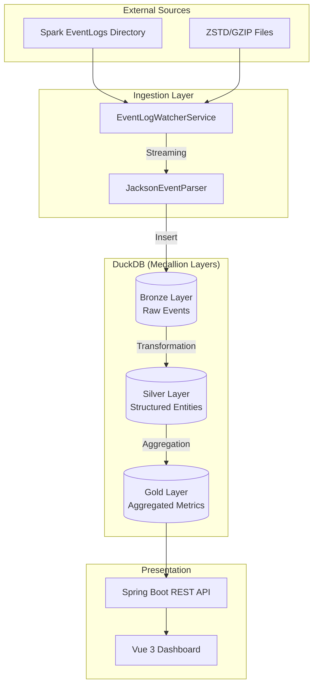
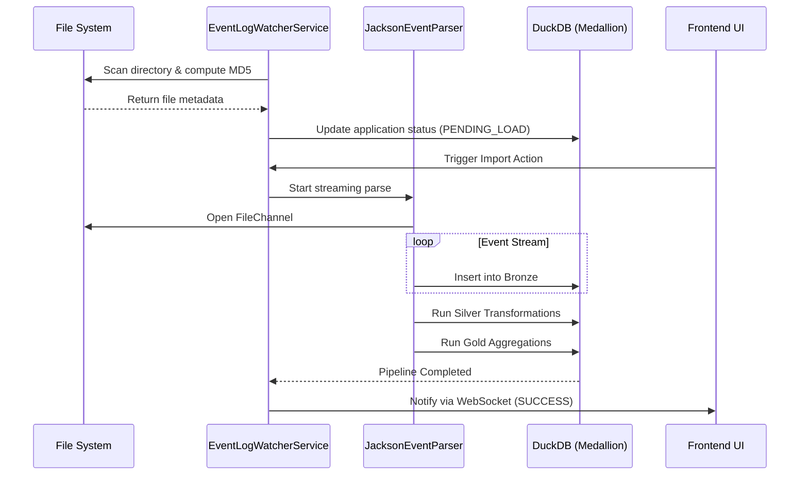

# System Architecture Design Specifications

[English](./Architecture.md) | [中文](../zh/Architecture.md)

## 1. Core Concept: Structured OLAP Analysis
Spark Performance Insight moves away from the traditional Spark History Server model of "event replaying" to restore memory state. Instead, it adopts a **Structured Data Pipeline**.

## 2. Medallion Architecture
The system uses a three-layer data evolution model to balance ingestion speed and query performance.

### 2.1 Bronze (Raw Layer) - Source of Truth
- **Responsibility**: Fast and complete preservation of raw EventLog data.
- **Implementation**: Uses Jackson streaming parsing of raw JSON, mapping each Event line directly to its corresponding Bronze table.
- **Optimization**: Tracks monotonically increasing progress based on `java.nio.channels.FileChannel` position.

### 2.2 Silver (Structured Layer) - Standardized
- **Responsibility**: Cleans data and restores logical associations (e.g., Stage for a Task, SQL for a Job).
- **Key Logic**:
    - **Metadata Restoration**: Extracts application info from `SparkListenerApplicationStart` and `LogStart`.
    - **Logical Linkage**: Restores parent-child relationships between SQL, Job, and Stage via properties like `spark.sql.execution.id`.
    - **Long Tail Identification**: Calculates basic execution characteristics of Tasks at this layer.

### 2.3 Gold (Aggregation Layer) - Analytical
- **Responsibility**: Pre-calculates high-performance analytical wide tables to support sub-second UI rendering.
- **Key Metrics**:
    - **Statistical Distribution**: Calculates quintiles (Min, 25%, Median, 75%, 95%, Max).
    - **Scoring Engine**: Health scoring (0-100) based on GC ratio, data skew, spill amount, etc.

## 3. System Processing Sequence

## 4. Concurrency Model
- **Virtual Threads (Java 21)**: Extensively uses virtual threads for I/O-intensive tasks (log reading and DB writing), significantly improving system throughput under high-concurrency scans.

## 5. Storage Engine (DuckDB)
- **Embedded OLAP**: Uses DuckDB for its columnar storage and vectorized execution advantages, enabling ultra-fast aggregation over millions of Tasks.
- **Auto-Recovery**: Monitors `Out of Memory` errors, automatically triggering `CHECKPOINT` to force disk flushing and release memory cache.
