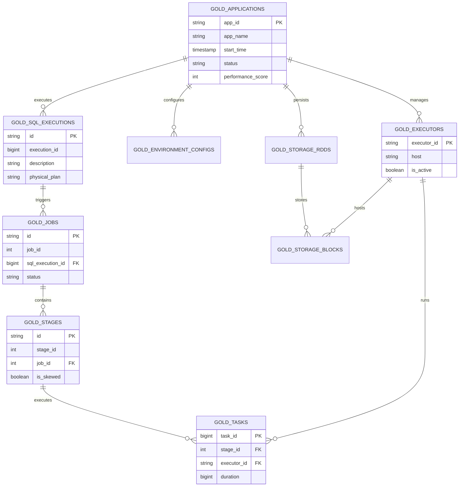

# Database Storage Design Specifications

[English](./Database_Design.md) | [中文](../zh/Database_Design.md)

## 1. Storage Engine: DuckDB
The project uses DuckDB 1.1.x as the core OLAP engine. All data is persisted in the `.duckdb.db` file within the `out/` directory.

## 2. Table Naming Conventions
| Prefix | Description | Example |
| :--- | :--- | :--- |
| **`bronze_`** | Raw event tables, stores raw JSON lines before parsing | `bronze_event_task_end` |
| **`silver_`** | Structured fact tables, modeled by entity | `silver_tasks`, `silver_stages` |
| **`gold_`** | Aggregated analytical tables, read directly by UI | `gold_applications`, `gold_jobs` |
| **`sys_`** | Internal system management tables | `sys_parsing_queue` |

## 3. Core Entity Relationship Diagram (ER Diagram)
The system uses a typical hierarchical monitoring model, with all entities isolated at the top level by `app_id`.

## 4. Memory Protection & Retry (OOM Protection)
Since DuckDB runs within the JVM process, it may hit memory thresholds when processing large-scale data (millions of Tasks).

### 4.1 Auto-Recovery Algorithm
1.  **Detection**: Catches `java.sql.SQLException`, checks if the message contains `Out of Memory` or `could not allocate block`.
2.  **Forced Release**: Calls `CHECKPOINT` to force DuckDB to flush dirty pages from the Buffer Manager to disk.
3.  **Reconfiguration**: Re-executes `SET memory_limit = '...'` to align with the current config.
4.  **Retry**: Automatically re-executes the last SQL task that caused the OOM.

## 5. Key Index Optimizations
- Uses **AppId** extensively as a partition/filtering key.
- Utilizes DuckDB's Min/Max Zone Maps for range pruning on ultra-large tables like `gold_tasks`.
