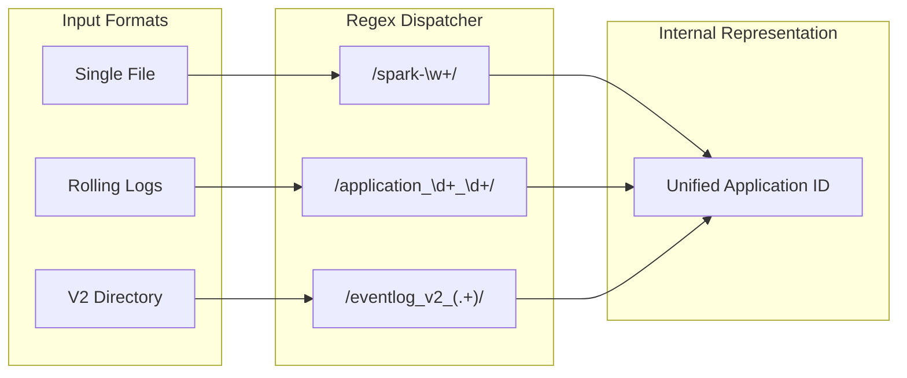

# EventLog Technical Reference

[English](./EventLog_Reference.md) | [中文](../zh/EventLog_Reference.md)

## 1. Supported Naming Conventions
The system automatically identifies and categorizes associated log files into the same Spark Application instance via regular expressions.

| Pattern Type | Example Filename | Notes |
| :--- | :--- | :--- |
| **Standard AppId** | `spark-48289a2...` | Standard Spark official format |
| **Event Prefix** | `event_1_spark-xxx` | Rolling log format |
| **Application Prefix** | `application_1771297982554_0002` | YARN mode log name |
| **Directory Logs (V2)** | `eventlog_v2_application_xxx/` | Spark 3.x+ V2 storage structure |

## 2. Supported Compression Formats
Built-in streaming decompression engine; no manual extraction required.

| Format | Extension | Description |
| :--- | :--- | :--- |
| **ZSTD (Recommended)** | `.zstd`, `.zst` | High compression ratio and parsing speed |
| **GZIP** | `.gz`, `.gzip` | Universal compression format |
| **LZ4** | `.lz4` | High-speed decompression |
| **SNAPPY** | `.snappy` | Low-latency compression |

## 3. Scanning Mechanism
- **Change Detection**: Incremental scanning based on file lists and MD5 fingerprints.
- **State Awareness**: Automatically recognizes `PENDING_LOAD` (newly discovered) and `PENDING_REIMPORT` (log content changed).
