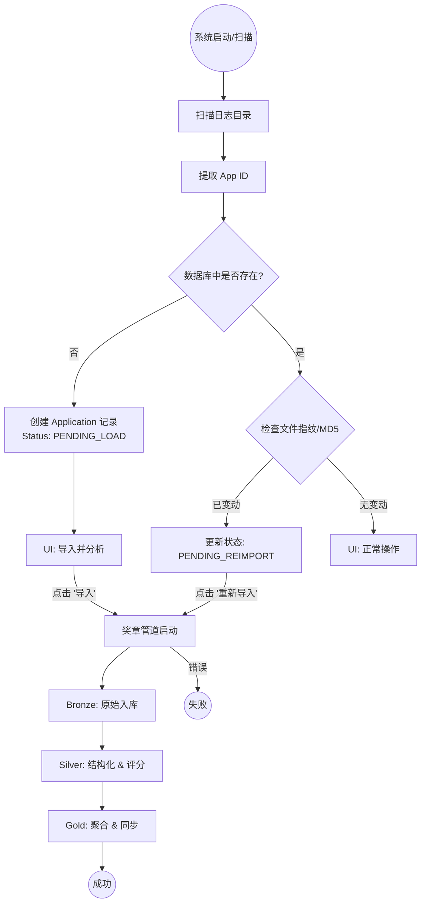

# Application 导入状态机

[English](../en/Application_Import_State_Machine.md) | [中文](./Application_Import_State_Machine.md)

本文档描述了 Spark EventLog 在通过奖章架构（Bronze -> Silver -> Gold）移动时的状态机和生命周期。

## 1. 状态机流程

## 2. 状态定义与生命周期

`applications` 表通过以下 `parsing_status` 值跟踪进度：

| 状态码 | UI 显示 | 管道事件 | 可用操作 |
| :--- | :--- | :--- | :--- |
| `PENDING_LOAD` | 等待加载 | `SCAN: New App Found` | 导入并分析 |
| `INGESTING_BRONZE` | 正在导入 Bronze | `IMPORT: Bronze Start` | 无 (锁定) |
| `TRANSFORMING_SILVER` | 正在构建 Silver | `TRANSFORM: Silver Start` | 无 (锁定) |
| `AGGREGATING_GOLD` | 正在计算 Gold | `AGGREGATE: Gold Start` | 无 (锁定) |
| `SUCCESS` | 成功 | `SUCCESS: Pipeline Finished` | 详情, 重新导入, 删除 |
| `FAILED` | 失败 | `FAILED: Pipeline Error` | 重新导入, 删除 |
| `PENDING_REIMPORT` | 日志已变动 | `SCAN: Log File Changed` | 重新导入, 删除 |

## 3. 数据完整性

*   **指纹识别**：对于每个应用，系统计算所有关联日志文件的 MD5 哈希值。
*   **元数据**：存储在 `source_file_metadata` 列 (JSON) 中，格式为 `[{name, md5, size}]`。
*   **重新导入触发**：如果文件被添加、删除或修改，在下一次目录扫描期间，状态会自动设置为 `PENDING_REIMPORT`。
