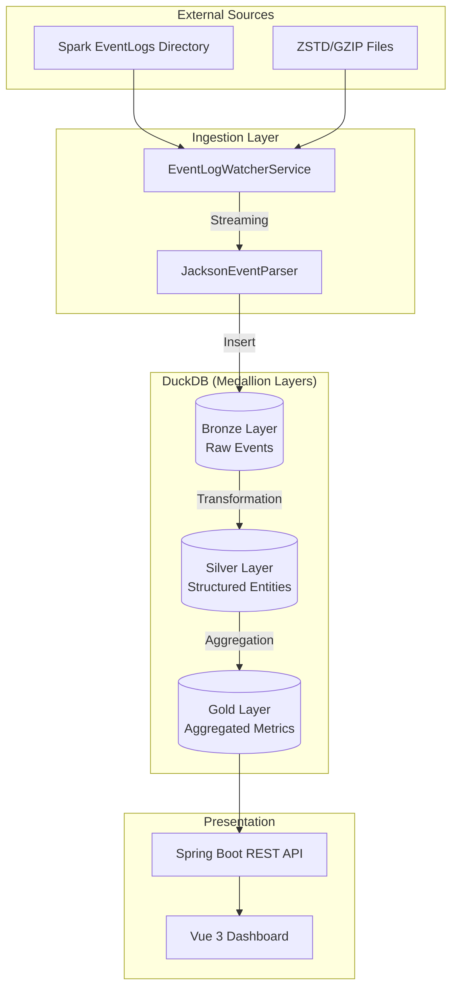
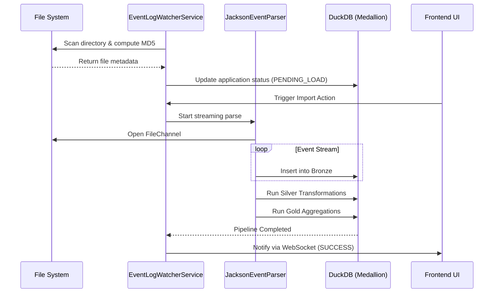

# 系统架构设计规格

[English](../en/Architecture.md) | [中文](./Architecture.md)

## 1. 核心理念：结构化 OLAP 分析
Spark-Performance-Insight 抛弃了传统 Spark History Server 依赖“重放事件”来恢复内存状态的模式，转而采用 **结构化数据流 (Structured Data Pipeline)**。

## 2. 奖章架构 (Medallion Architecture)
系统内部采用三层数据演进模型，以平衡入库速度与查询性能。

### 2.1 Bronze (原始层) - Source of Truth
- **职责**: 快速、完整地保存原始 EventLog 数据。
- **实现**: 采用 Jackson 流式解析原始 JSON，将每一行 Event 直接映射到对应的 Bronze 表。
- **优化**: 基于 `java.nio.channels.FileChannel` 的位置进行单调递增的进度追踪。

### 2.2 Silver (结构化层) - Standardized
- **职责**: 清洗数据，恢复逻辑关联（如 Task 所属的 Stage，Job 所属的 SQL）。
- **关键逻辑**:
    - **元数据恢复**: 从 `SparkListenerApplicationStart` 和 `LogStart` 提取应用信息。
    - **逻辑链路**: 通过 `spark.sql.execution.id` 等属性恢复 SQL、Job、Stage 之间的父子关系。
    - **长尾识别**: 在此层计算 Task 的基本执行特征。

### 2.3 Gold (汇聚层) - Analytical
- **职责**: 预计算高性能分析宽表，支撑秒级 UI 展示。
- **关键指标**:
    - **统计分布**: 计算五分位数 (Min, 25%, Median, 75%, 95%, Max)。
    - **评分引擎**: 基于 GC 占比、数据倾斜度、溢写量等维度进行健康度打分 (0-100)。

## 3. 系统处理时序

## 4. 并发模型
- **虚拟线程 (Java 21 Virtual Threads)**: 全面采用虚拟线程处理 I/O 密集型任务（日志读取与 DB 写入），大幅提升在高并发扫描下的系统吞吐量。

## 4. 存储引擎 (DuckDB)
- **嵌入式 OLAP**: 选择 DuckDB 作为存储引擎，利用其列式存储和向量化执行优势，实现对百万级 Task 的极速聚合。
- **自动恢复**: 监听 `Out of Memory` 错误，自动触发 `CHECKPOINT` 强制刷盘并释放内存缓存。
