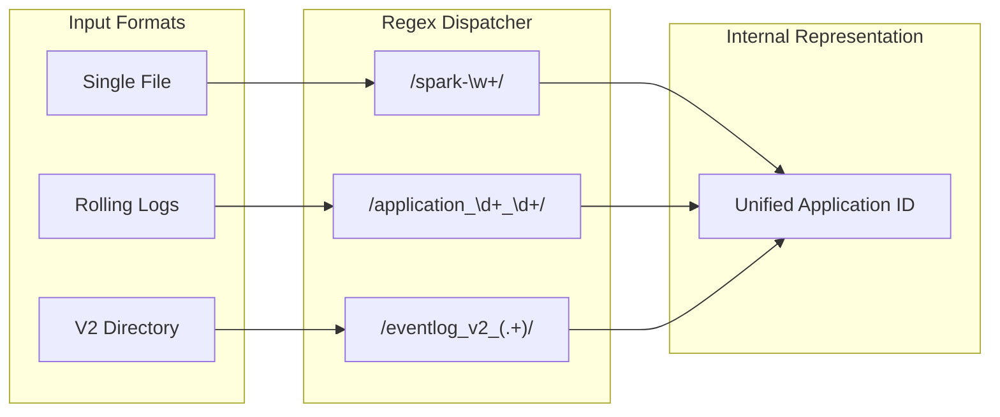

# EventLog 技术参考资料

[English](../en/EventLog_Reference.md) | [中文](./EventLog_Reference.md)

## 1. 支持的命名规范
系统通过正则表达式自动识别并将关联的日志文件归类为同一个 Spark Application 实例。

| 模式类型 | 示例文件名 | 备注 |
| :--- | :--- | :--- |
| **标准 AppId** | `spark-48289a2...` | Spark 官方标准格式 |
| **Event 前缀** | `event_1_spark-xxx` | 滚动日志格式 |
| **Application 前缀** | `application_1771297982554_0002` | YARN 运行模式下的日志名 |
| **目录式日志 (V2)** | `eventlog_v2_application_xxx/` | Spark 3.x+ V2 存储结构 |

## 2. 支持的压缩格式
无需手动解压，系统内置流式解压引擎。

| 格式 | 后缀 | 说明 |
| :--- | :--- | :--- |
| **ZSTD (推荐)** | `.zstd`, `.zst` | 提供极高的压缩比和解析速度，系统原生优化 |
| **GZIP** | `.gz`, `.gzip` | 通用压缩格式 |
| **LZ4** | `.lz4` | 高速解压格式 |
| **SNAPPY** | `.snappy` | 低延迟压缩格式 |

## 3. 扫描机制
- **变更检测**: 基于文件列表及其 MD5 指纹进行增量扫描。
- **状态感知**: 自动识别 `PENDING_LOAD` (新发现) 与 `PENDING_REIMPORT` (日志内容已变动)。
