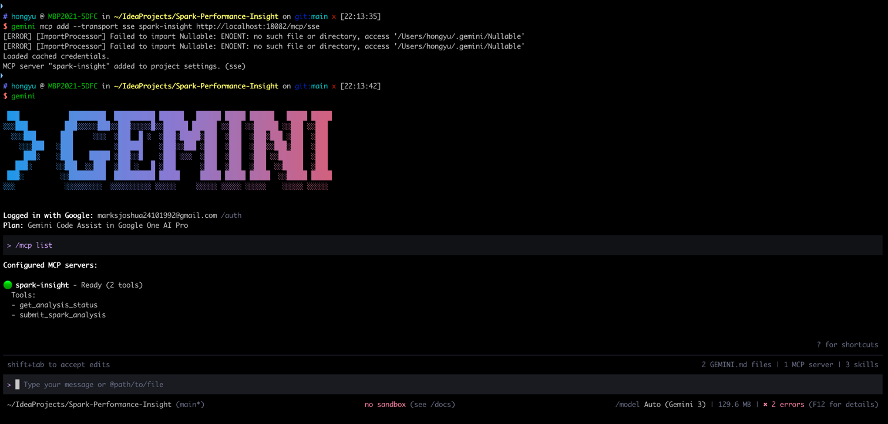
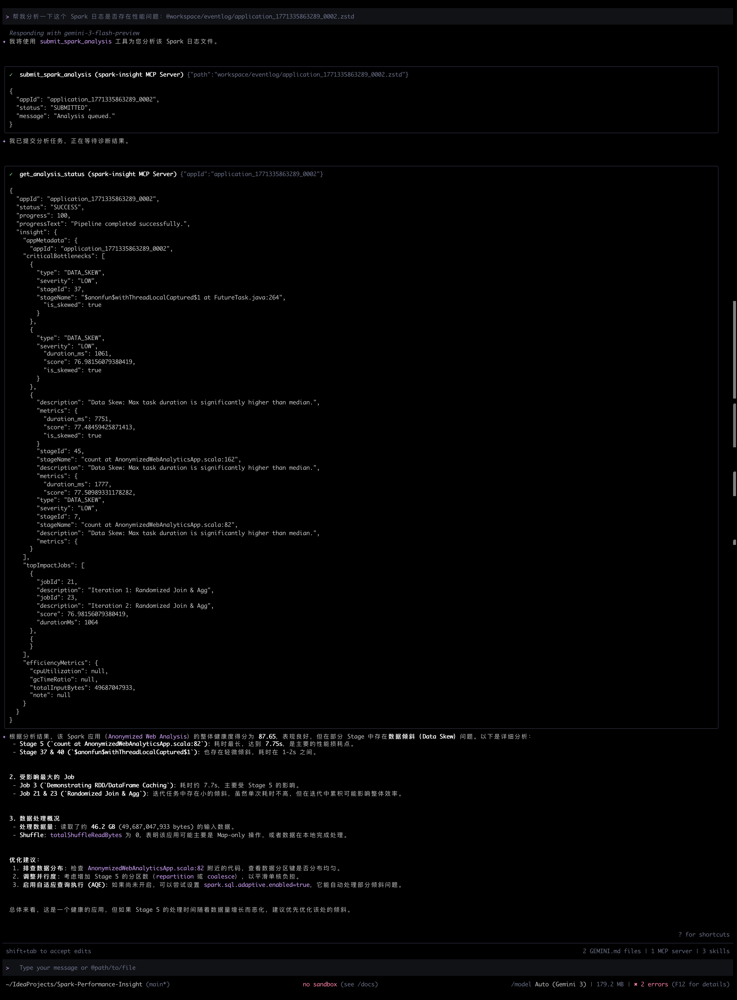
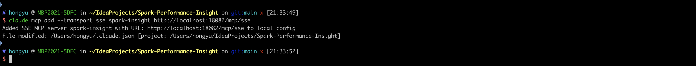
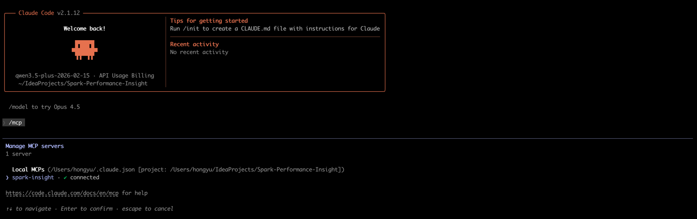
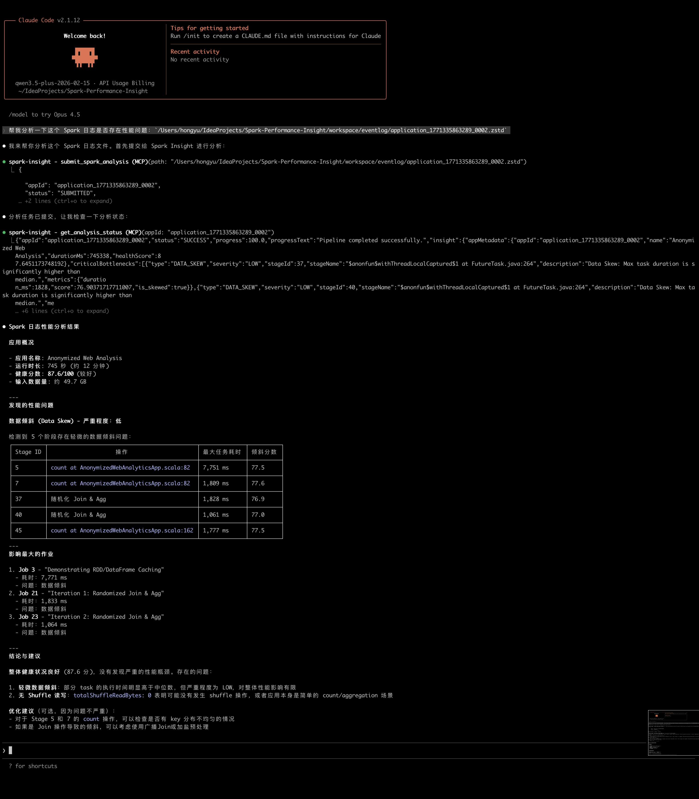

# Spark Performance Insight MCP 使用指南

本模块允许 LLM (如 Claude, Gemini) 直接调用本地工具解析并分析 Spark EventLog。

## 1. Gemini CLI 配置
如果你正在使用 `@google/gemini-cli`，可以通过以下命令快速添加 MCP 服务：

```bash
gemini mcp add --transport sse spark-insight http://localhost:18082/mcp/sse
```



*(注：图中展示了使用 gemini mcp add 命令成功添加服务后的提示信息)*



*(注：图中展示了 Gemini 自动调用 Spark 分析工具并根据结果给出优化建议的过程)*

---

## 2. Claude Code (CLI) 配置
`claude-code` 是 Anthropic 推出的命令行交互工具。

直接运行以下命令即可添加：
```bash
claude mcp add --transport sse spark-insight http://localhost:18082/mcp/sse
```




*(注：图中展示了使用 claude mcp add 命令成功添加服务及 Claude Code 内部确认的提示信息)*

---

## 3. 推荐对话流程 (User Prompt)
配置完成后，你可以尝试这样与 AI 对话：

> **User**: "帮我分析一下这个 Spark 日志是否存在性能问题：`/data/logs/application_123.zstd`"
>
> **AI (自动操作)**:
> 1. 调用 `submit_spark_analysis(path="/data/logs/application_123.zstd")` -> 获得 `appId`.
> 2. 轮询 `get_analysis_status(appId="...")` 直到进度 100%.
> 3. AI 获取 `insight` JSON 数据，并直接在对话中给出优化建议。


*(注：图中展示了 AI Agent 自动调用 Spark 分析工具并给出反馈的过程)*

## ⚠️ 注意事项
*   **Java 版本**: 请确保系统默认 `java` 命令是 Java 21。如果不是，请在 `command` 处填写 Java 21 的绝对路径。
*   **权限**: 确保 AI 进程有权读取你提供的 EventLog 路径。
