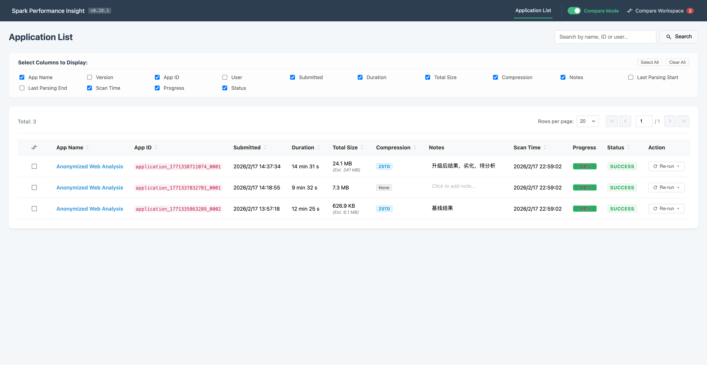

# UI: 应用列表 (首页)

[English](../../en/ui/Application_List.md) | [中文](./Application_List.md)

应用列表是系统的入口，提供所有检测到和已处理的 Spark 应用的全局视图。

## 📊 可见信息
- **应用元数据**：名称、Spark 版本、Application ID 和用户。
- **时间轴**：提交时间和总执行时长。
- **资源使用**：总日志大小和压缩格式。
- **处理状态**：当前的奖章架构管道状态（Bronze/Silver/Gold/成功/失败）。
- **交互操作**：开始导入、全量重新导入，以及从 Bronze 或 Silver 层选择性重新处理。

## 🔍 数据来源
- **核心表**：`gold_applications` (DuckDB)。
- **队列信息**：来自 `sys_parsing_queue` 的实时状态。
- **发现机制**：`EventLogWatcherService` 扫描配置的目录并更新 `sys_event_log_scans`。

## 🖼 界面展示

